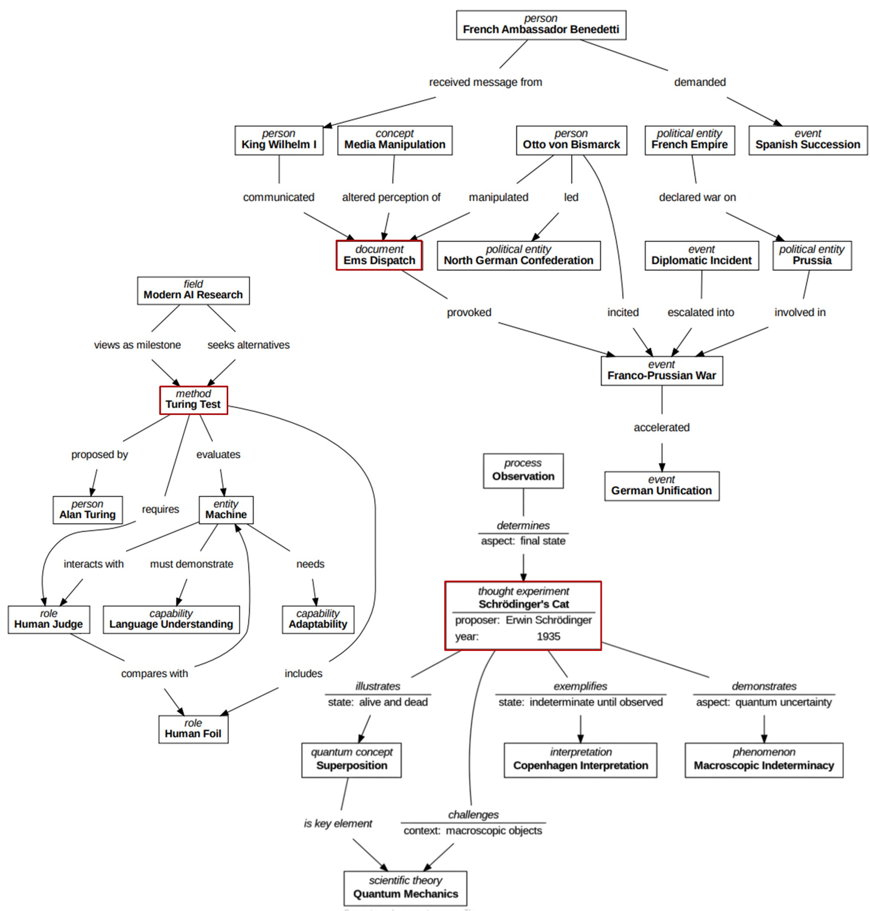

# concept-mapper

## Overview
concept-mapper is a web application designed to generate concept maps from various text sources using Large Language Models (LLMs). It enables users to extract structured knowledge from unstructured text and visualize it as a concept map. 

## Features
- **Flexible Input Options**: Accepts raw text, uploaded documents (PDF, TXT, MD, TEX), and web URLs for processing.
- **Configuaration Options**: Users can configure the concept map generation process, see next Section.
- **Concept Map Generation**: Uses OpenAI and Mistral LLM APIs to extract concepts and relationships.
- **Graph Visualization**: Outputs concept maps in multiple formats (PDF, PNG, SVG, etc.) using [Graphviz](https://graphviz.org/).
- **Evaluation Metrics**: Includes the calculation of various graph-based metrics to assess the generated concept maps.
- **Docker Support**: Provides containerized deployment for ease of use.

## Configuration Options
Users can configure the concept map generation process using the following parameters:
- **Model Selection**: Choose between OpenAI and Mistral LLMs.
- **Temperature**: Adjust the creativity of the models output (0.0-0.8).
- **Number of Nodes**: Specifies a reference value for the number of concepts, that should will be extracted (2-32; actual number of concepts in the generated map may vary).
- **Context Preset**: Select between "default", "scientific", "wiki-text", or "mathematical" modes (currently just affecting some keywords in the utilized prompts, much room for improvement here)
- **Visualization Options**: Toggle display of concept labels, node properties, and edge properties in the generated map.
- **File Output Format**: Generate concept maps in PDF, PNG, SVG, and other formats.

## Examples
The following depiction features three concept maps generated using the GPT-4o model. The graph in the center-left is based on a concise textual description of the [Turing Test](https://plato.stanford.edu/entries/turing-test/), sourced from the Stanford Encyclopedia of Philosophy. The other two graphs were generated from the respective Wikipedia articles on the [Ems Dispatch](https://en.wikipedia.org/wiki/Ems_dispatch) and [Schrödinger's Cat](https://en.wikipedia.org/wiki/Schr%C3%B6dinger%27s_cat). The scientific and wiki-text context presets were used, along with low temperature settings between 0.1 and 0.4. Each concept map was selected from five consecutive generations as a representative example.



## Approach
concept-mapper follows a multi-step approach to generate concept maps from unstructured text:
1. **Text Input Processing**: The application extracts text from the given source  (uploaded file, website given by URL).
2. **Summary Generation**: The specified Large Language Model (LLM) is used to summarize the text and identify key concepts/relations in a semi-structured manner.
3. **Concept Extraction**: The LLM generates a structured representation of the concept-map (concepts, relations, properties).
4. **Visualization**: The structured data is processed and visualized using Graphviz to create the final concept map.
5. **Evaluation**: Computation of graph-based metrics, that allow a quantitative evaluation of the generated concept map.


## Installation
### Clone the Repository
```bash
 git clone https://github.com/LennartKoepper/concept-mapper.git
 cd concept-mapper
```

### Set Environment Variables
1. In `/cm-backend` rename `.env.template` to `.env`.
2. Replace `YOUR_VALUE` in the line `OPENAI_API_KEY=YOUR_VALUE` with your OpenAI-API-Key.
3. Replace `YOUR_VALUE` in the line `MISTRAL_API_KEY=YOUR_VALUE` with your Mistral-API-Key.
4. Replace `YOUR_VALUE` in the line `CM_OUT_DIR=YOUR_VALUE` with a suitable directory to temporarily store generated concept maps on the executing system (your system or docker container). E.g. `/app/temp_output`.

### A) Containerized Deployment via Docker
**Prerequisites:**
* [Docker](https://www.docker.com/) (or Docker-Desktop) is installed on your system
* Docker-Daemon is running

1. Navigate into the root-directory of the repository.
2. Execute command `docker-compose up`.

After the build completed and both Docker-Containers (Frontend and Backend) started successfully, you should be able to use the application at `http://localhost:8080`.

### B) Installation for Development
**Prerequisites**
- [Python 3.10+](https://www.python.org/downloads/)
- [Node.js](https://nodejs.org/en/download/) 
- [Angular V18](https://v18.angular.dev/installation)
- **Before running the application, ensure that you provide a `.env` file with necessary API keys and configurations.**

#### Backend Setup
1. Navigate into the root-directory of the repository and create a virtual environment providing the required dependencies:
```bash
conda env create -f environment.yml
conda activate conceptmapper-env
```

2. Start the FastAPI server:
```bash
fastapi dev concept_mapper_api.py
```

#### Frontend Setup
1. Navigate to the frontend directory:
```bash
cd cm-frontend
```
2. Install dependencies:
```bash
npm install
```
3. Start the Angular development server:
```bash
ng serve --open
```

## Future Enhancements
concept-mapper is currently just a proof of concept, with much room for improvement and/or alternative approaches. Some approaches 
- Fine-tuning LLMs for improved concept extraction.
- Chunking for handling long input texts.

## Contact
Developed by **Lennart Köpper** as part of a  project at Coburg University of Applied Sciences.
For inquiries, contact: [Lennart.Koepperl@stud.hs-coburg.de]

